# Election Manager — Complete Documentation

> A full-stack Election Campaign Field Operations Management System built for managing 300+ towns, 70,000+ voters, and 300+ team members.

---

## Table of Contents

1. [Tech Stack & Architecture](#tech-stack--architecture)
2. [Project Structure](#project-structure)
3. [Features & Screenshots](#features--screenshots)
4. [How It Works — User Flows](#how-it-works--user-flows)
5. [Database Schema](#database-schema)
6. [API Endpoints](#api-endpoints)
7. [Security Architecture](#security-architecture)
8. [How to Run](#how-to-run)
9. [Test Credentials](#test-credentials)

---

## Tech Stack & Architecture

### Frontend

| Technology | Purpose | Version |
|---|---|---|
| **React.js** | UI framework — component-based single page application | 18.3 |
| **Vite** | Build tool — ultra-fast dev server and production bundler | 5.4 |
| **TailwindCSS** | Utility-first CSS framework — responsive modern design | 3.4 |
| **React Router DOM** | Client-side routing — SPA navigation without page reloads | 6.26 |
| **Axios** | HTTP client — communicates with backend API | 1.7 |
| **Recharts** | Charting library — dashboard bar charts and pie charts | 2.12 |
| **Lucide React** | Icon library — 1000+ clean SVG icons | 0.400 |
| **XLSX (SheetJS)** | Excel parser — client-side file preview before upload | 0.18 |

### Backend

| Technology | Purpose | Version |
|---|---|---|
| **Node.js** | Runtime environment — JavaScript server | 24.x |
| **Express.js** | Web framework — REST API routing and middleware | 4.21 |
| **sql.js (SQLite)** | Database — lightweight, file-based, zero-config SQL database | 1.11 |
| **JSON Web Tokens (JWT)** | Authentication — stateless token-based auth | 9.0 |
| **bcryptjs** | Password hashing — secure password storage | 2.4 |
| **Multer** | File upload — handles Excel/CSV and video uploads | 1.4 |
| **XLSX (SheetJS)** | Excel parser — server-side voter list processing | 0.18 |
| **CORS** | Cross-origin — allows frontend-backend communication | 2.8 |

### Architecture Pattern

```
┌─────────────────────────────────────────────────────────┐
│                    CLIENT (Browser)                      │
│  ┌──────────────────────────────────────────────────┐   │
│  │           React SPA + TailwindCSS                 │   │
│  │  ┌──────────┐ ┌──────────┐ ┌──────────────────┐  │   │
│  │  │  Login   │ │Dashboard │ │ ManageTeam/Areas │  │   │
│  │  └──────────┘ └──────────┘ └──────────────────┘  │   │
│  │  ┌──────────┐ ┌──────────┐ ┌──────────────────┐  │   │
│  │  │ VoterList│ │ MyList   │ │ Search/Notif/Vid │  │   │
│  │  └──────────┘ └──────────┘ └──────────────────┘  │   │
│  └──────────────────┬───────────────────────────────┘   │
│                     │ HTTP (Axios)                       │
└─────────────────────┼───────────────────────────────────┘
                      │
        ┌─────────────▼──────────────┐
        │    EXPRESS.JS SERVER       │
        │    (Port 4000)             │
        │  ┌───────────────────┐     │
        │  │  JWT Auth Middleware│    │
        │  └────────┬──────────┘     │
        │  ┌────────▼──────────┐     │
        │  │  RBAC Middleware   │     │
        │  │  (Role Checking)   │     │
        │  └────────┬──────────┘     │
        │  ┌────────▼──────────┐     │
        │  │  Route Handlers    │     │
        │  │  /api/auth         │     │
        │  │  /api/users        │     │
        │  │  /api/areas        │     │
        │  │  /api/voters       │     │
        │  │  /api/dashboard    │     │
        │  │  /api/notifications│     │
        │  │  /api/videos       │     │
        │  └────────┬──────────┘     │
        └───────────┼────────────────┘
                    │
        ┌───────────▼────────────────┐
        │  SQLite Database           │
        │  (election.db file)        │
        │  ┌──────┐ ┌──────┐        │
        │  │users │ │voters│        │
        │  ├──────┤ ├──────┤        │
        │  │areas │ │notifs│        │
        │  ├──────┤ ├──────┤        │
        │  │videos│ │ logs │        │
        │  └──────┘ └──────┘        │
        └────────────────────────────┘
```

### Design Decisions

1. **SQLite over PostgreSQL** — Zero configuration, single file database. Perfect for prototyping and local testing. Can migrate to PostgreSQL for production.
2. **sql.js (WASM) over better-sqlite3** — Pure JavaScript SQLite implementation. No native compilation needed, works on any Node.js version.
3. **JWT over Sessions** — Stateless authentication. No server-side session storage needed. Tokens stored in localStorage.
4. **Single Server for Production** — Backend serves the built React app. One URL, one port, easy to share and tunnel.
5. **Vite Proxy for Development** — Frontend dev server proxies API calls to backend. Hot-reload without CORS issues.
6. **TailwindCSS over Bootstrap** — Utility-first approach for rapid, consistent UI. Smaller bundle, more customizable.
7. **Responsive Design** — Mobile-first approach. Works on phones (field workers) and desktops (admins).

---

## Project Structure

```
election-app/
├── backend/
│   ├── package.json              # Backend dependencies
│   ├── server.js                 # Express server entry point
│   ├── db.js                     # Database setup, wrapper, seed data
│   ├── middleware/
│   │   └── auth.js               # JWT authentication + RBAC middleware
│   ├── routes/
│   │   ├── auth.js               # Login, current user
│   │   ├── users.js              # CRUD users, hierarchy, sub-workers
│   │   ├── areas.js              # CRUD areas/towns with stats
│   │   ├── voters.js             # Voter list, upload, assign, status
│   │   ├── dashboard.js          # Stats, area stats, worker stats, today
│   │   ├── notifications.js      # Send, read, mark-read notifications
│   │   └── videos.js             # Upload, list, delete guide videos
│   ├── uploads/                  # Uploaded files (videos)
│   └── election.db               # SQLite database file (auto-generated)
│
├── frontend/
│   ├── package.json              # Frontend dependencies
│   ├── index.html                # HTML entry point
│   ├── vite.config.js            # Vite config + API proxy
│   ├── tailwind.config.js        # Tailwind configuration
│   ├── postcss.config.js         # PostCSS for Tailwind
│   └── src/
│       ├── main.jsx              # React entry point
│       ├── App.jsx               # Main app with all routes
│       ├── index.css             # Tailwind directives + custom classes
│       ├── context/
│       │   └── AuthContext.jsx    # Global auth state management
│       ├── utils/
│       │   └── api.js            # Axios instance with JWT interceptor
│       ├── components/
│       │   ├── Layout.jsx        # Sidebar + header + responsive layout
│       │   └── ProtectedRoute.jsx# Route guard with role checking
│       └── pages/
│           ├── Login.jsx         # Phone + password login
│           ├── Dashboard.jsx     # Admin analytics dashboard
│           ├── ManageTeam.jsx    # Team hierarchy management
│           ├── ManageAreas.jsx   # Area/town management
│           ├── UploadVoters.jsx  # Excel/CSV voter list upload
│           ├── VoterList.jsx     # Full voter list with filters
│           ├── MyList.jsx        # Field worker's assigned list
│           ├── GlobalSearch.jsx  # Search voters by name/ID
│           ├── Notifications.jsx # Send/receive notifications
│           └── VideoGuide.jsx    # Upload/watch guide videos
│
├── screenshots/                  # Auto-captured screenshots
├── take-screenshots.js           # Puppeteer script for screenshots
├── PROMPT.md                     # Original prompt that built this app
├── DOCUMENTATION.md              # This file
└── README.md                     # Quick start guide
```

---

## Features & Screenshots

### 1. Login Page

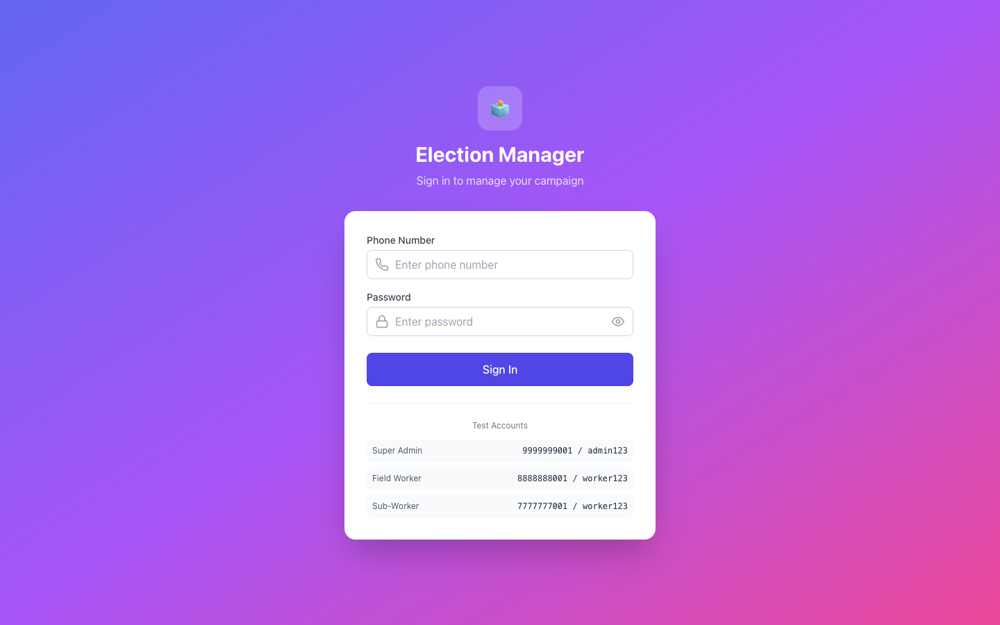

**What it does:**
- Beautiful gradient login screen
- Phone number + password authentication
- Show/hide password toggle
- Error messages for invalid credentials
- Test account credentials displayed for easy testing
- Responsive — works on mobile and desktop

**Technical:** JWT token generated on login, stored in localStorage, sent with every API request via Axios interceptor.

---

### 2. Super Admin Dashboard

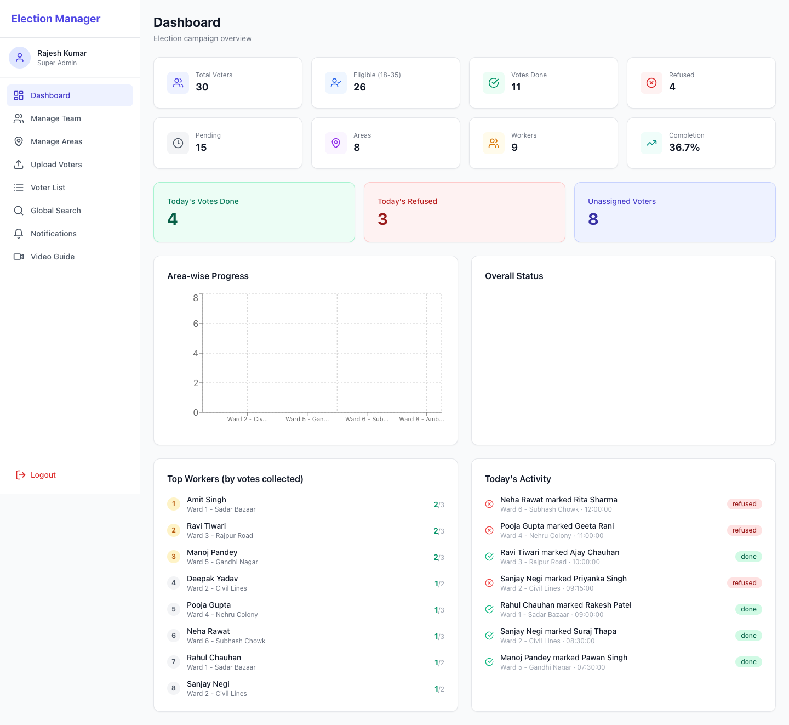

**What it does:**
- **8 stat cards** at the top: Total Voters, Eligible (18-35), Votes Done, Refused, Pending, Areas, Workers, Completion %
- **Today's highlights**: Today's votes done, today's refused, unassigned voters
- **Area-wise Progress Chart**: Stacked bar chart showing done/refused/pending per area
- **Overall Status Pie Chart**: Visual breakdown of all voter statuses
- **Top Workers Leaderboard**: Ranked by votes collected with area info
- **Today's Activity Feed**: Real-time log of who marked which voter, with timestamps

**Technical:** 4 parallel API calls on page load (`/stats`, `/area-stats`, `/worker-stats`, `/today`). Charts built with Recharts library.

---

### 3. Manage Team

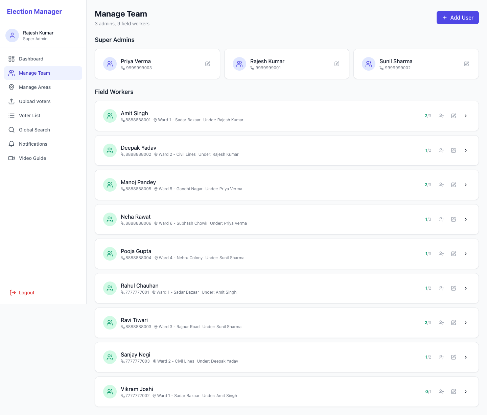

**What it does:**
- **Super Admin section**: List of all admins with phone numbers
- **Field Worker section**: All workers with area assignments, parent info, vote stats
- **Add User button**: Create new admin or worker with role, area, parent assignment
- **Edit any user**: Change name, phone, role, area, parent, activate/deactivate
- **Add Sub-Worker**: Click the person+ icon to add a sub-worker under any worker
- **Hierarchy View**: Click the expand arrow to see the full tree of sub-workers
- **Vote credit counting**: Sub-worker votes count under the parent worker

**Technical:** Recursive hierarchy API (`/users/:id/hierarchy`) builds the tree. Parent-child relationship via `parent_id` foreign key.

---

### 4. Manage Areas

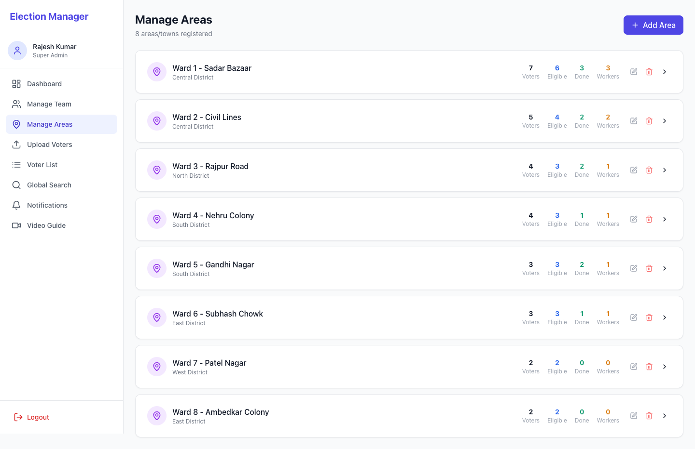

**What it does:**
- List of all 300+ areas/towns with stats
- Each area shows: Total voters, Eligible voters, Done, Workers assigned
- **Add Area**: Create new area with name and district
- **Edit/Delete Areas**: Modify or remove areas
- **Expand any area**: See detailed stats + list of all workers assigned to that area
- **Per-worker breakdown**: How many voters each worker in that area has processed

**Technical:** Area stats computed via SQL JOINs and aggregations. Worker stats nested inside area detail API.

---

### 5. Upload Voters

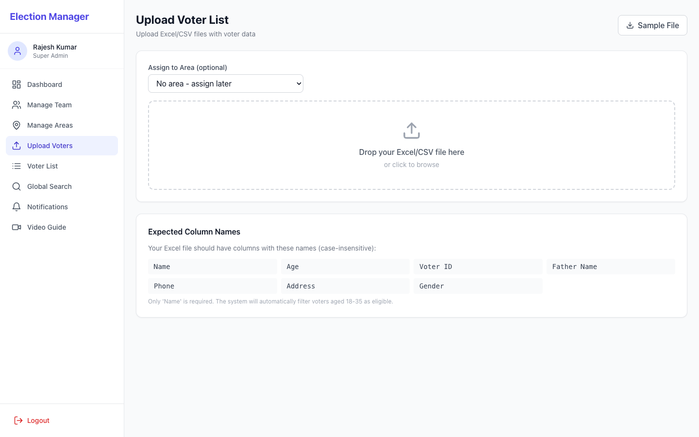

**What it does:**
- **Drag & drop zone**: Drop an Excel (.xlsx, .xls) or CSV file
- **Area selection**: Optionally assign uploaded voters to a specific area
- **File preview**: Shows first 10 rows of the uploaded file before importing
- **Smart column mapping**: Automatically maps columns (Name, Age, Voter ID, Father Name, Phone, Address, Gender)
- **Import results**: Shows total rows, imported, skipped (duplicates), eligible (18-35)
- **Download Sample**: Get a sample Excel file with correct column format
- **Expected Columns guide**: Shows which column names the system recognizes

**Technical:** Client-side preview uses SheetJS (XLSX). Server-side parsing via Multer (file upload) + XLSX. Duplicate detection via `INSERT OR IGNORE` on voter_id.

---

### 6. Voter List (Admin View)

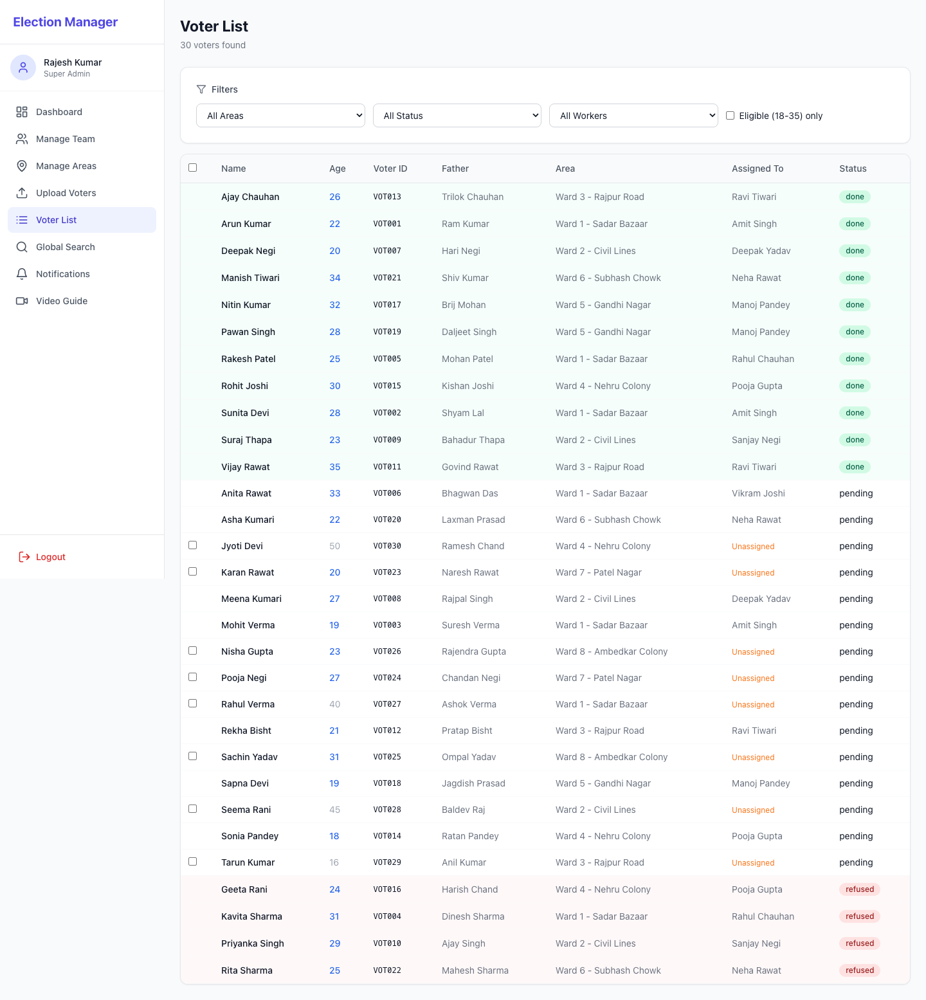

**What it does:**
- **Full voter table** with all fields: Name, Age, Voter ID, Father, Area, Assigned Worker, Status
- **4 filters**: By Area, By Status (pending/done/refused), By Worker, Eligible Only checkbox
- **Status badges**: Green for done, Red for refused, White/gray for pending
- **Age highlighting**: 18-35 age shown in blue (eligible)
- **Bulk selection**: Checkbox to select unassigned voters
- **Bulk assign**: Assign selected voters to any worker in one click
- **Quick area assign**: Auto-assign all unassigned voters in an area to a worker
- **Pagination**: Navigate through large voter lists (30 per page)

**Technical:** Parameterized SQL queries with dynamic filters. Pagination via LIMIT/OFFSET. Bulk assignment via transaction.

---

### 7. Global Search

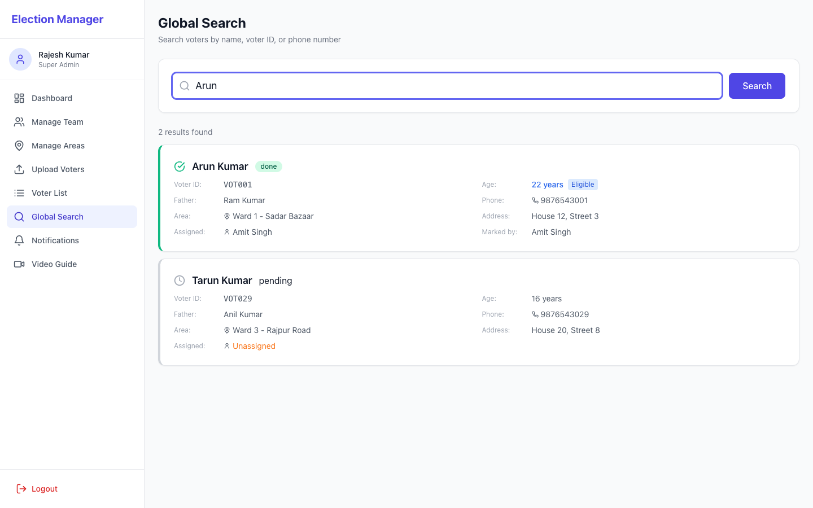

**What it does:**
- **Instant search**: Type a name, voter ID, or phone number — results appear as you type
- **Rich result cards**: Each result shows full voter details:
  - Name, Voter ID, Age (with eligibility badge), Father's name
  - Phone, Area, Address
  - **Who is this voter assigned to?**
  - **Has this voter voted yet?** (status with color indicator)
  - **Who marked the vote?** (worker name)
- **Color-coded border**: Green border for done, Red for refused, Gray for pending

**Technical:** SQL `LIKE` search across name, voter_id, phone, and father_name fields. Results include JOINed data from areas, assigned worker, and marker.

---

### 8. Notifications (Admin View)

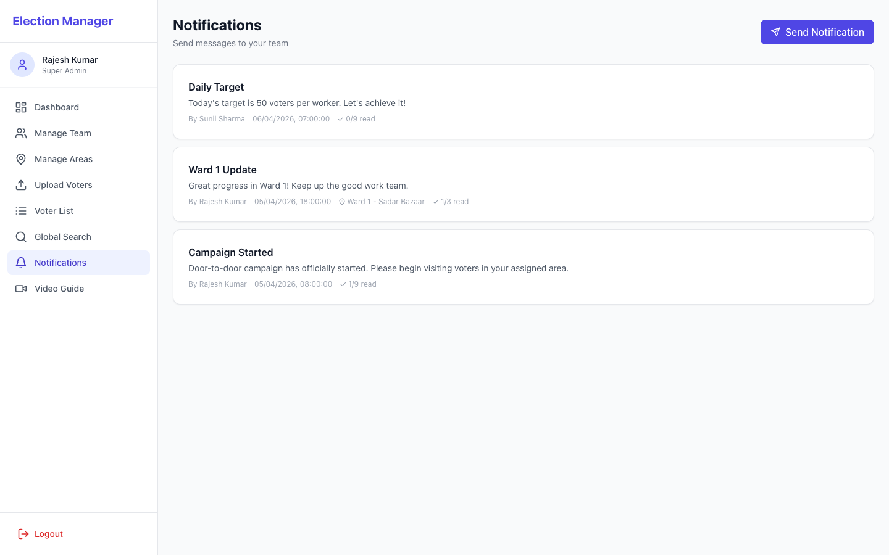

**What it does:**
- **Send Notification button**: Opens compose modal
- **Compose form**: Title, message, and target audience selector
- **Target options**: Send to ALL workers, or only workers in a specific area
- **Sent notifications list**: Shows all sent notifications with:
  - Read count (e.g., "3/9 read") — how many workers have read it
  - Target area (if specific)
  - Timestamp

**Technical:** Notifications stored in `notifications` table. Many-to-many relationship with users via `user_notifications` table (tracks read status per user).

---

### 9. Video Guide

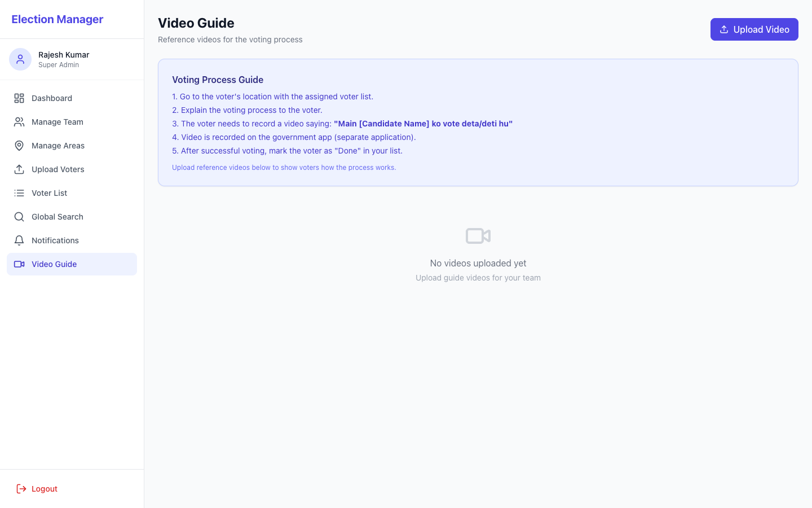

**What it does:**
- **Upload Video button**: Upload recorded MP4/WebM/MOV videos (up to 200MB)
- **Video cards**: Grid layout showing all uploaded videos with play button
- **Video player modal**: Click any video to play in a full-screen overlay
- **Voting process guide**: Step-by-step instructions:
  1. Go to voter's location
  2. Explain the voting process
  3. Voter records video saying "Main [Candidate Name] ko vote deta/deti hu"
  4. Video recorded on government app
  5. Mark voter as "Done" in the list
- **Delete videos**: Admin can remove uploaded videos

**Technical:** Videos uploaded via Multer to `/uploads/videos/` directory. File metadata stored in SQLite. Served as static files by Express.

---

### 10. Field Worker — My Voter List

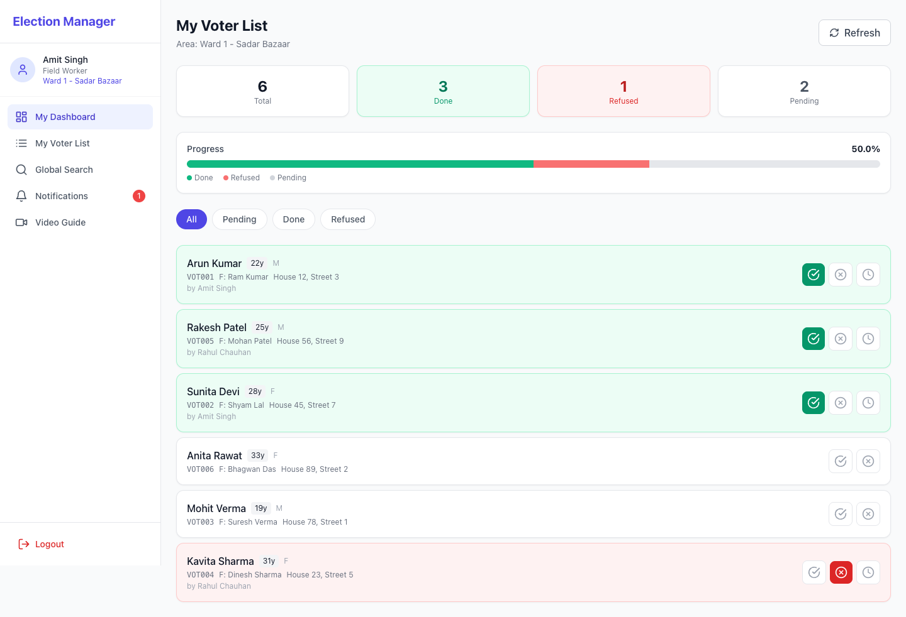

**What it does:**
- **Personal stats**: Total assigned, Done (green), Refused (red), Pending
- **Visual progress bar**: Shows green (done) and red (refused) proportions
- **Percentage completion**: e.g., "50.0%"
- **Filter tabs**: All, Pending, Done, Refused
- **Voter cards** with:
  - Name, Age, Gender, Voter ID, Father's name, Address
  - **Green check button**: Mark as Done (turns green, voter card turns green)
  - **Red X button**: Mark as Refused (turns red, voter card turns red)
  - **Clock button**: Reset back to Pending (appears only on marked voters)
- **Shared list behavior**: If another worker marks a voter, it shows green for everyone
- **Credit tracking**: "by [Worker Name]" shown under each marked voter

**Technical:** Voter status updated via `PUT /api/voters/:id/status`. Status change records `marked_by` (user ID) and `marked_at` (timestamp). Activity logged for audit.

---

### 11. Field Worker — Notifications

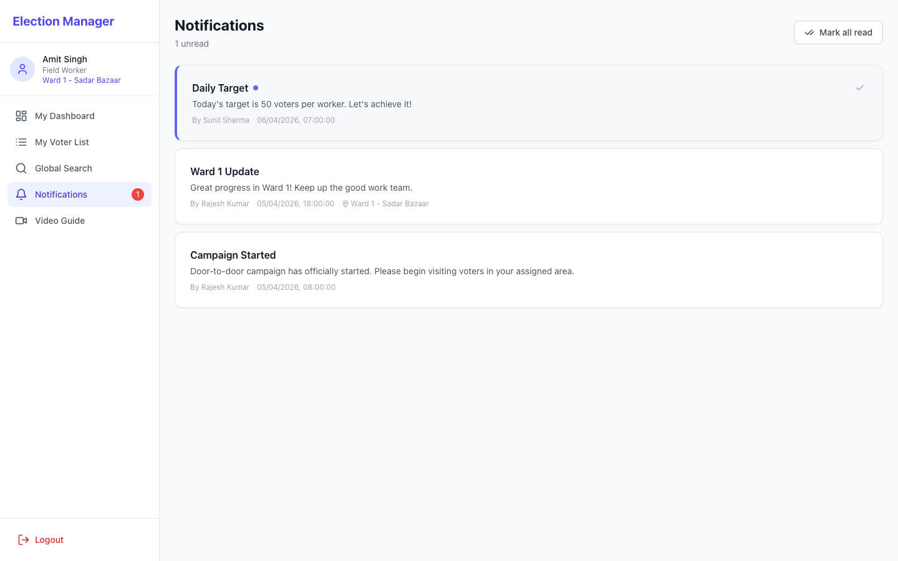

**What it does:**
- **Unread indicator**: Blue dot on unread notifications
- **Notification badge**: Red badge on sidebar showing unread count
- **Mark as read**: Click any notification to mark it as read
- **Mark all read**: Button to mark all notifications as read
- **Message details**: Title, message body, sent by whom, timestamp, target area

**Technical:** Unread count polled every 30 seconds. Read status tracked per user in `user_notifications` table.

---

### 12. Field Worker — Search

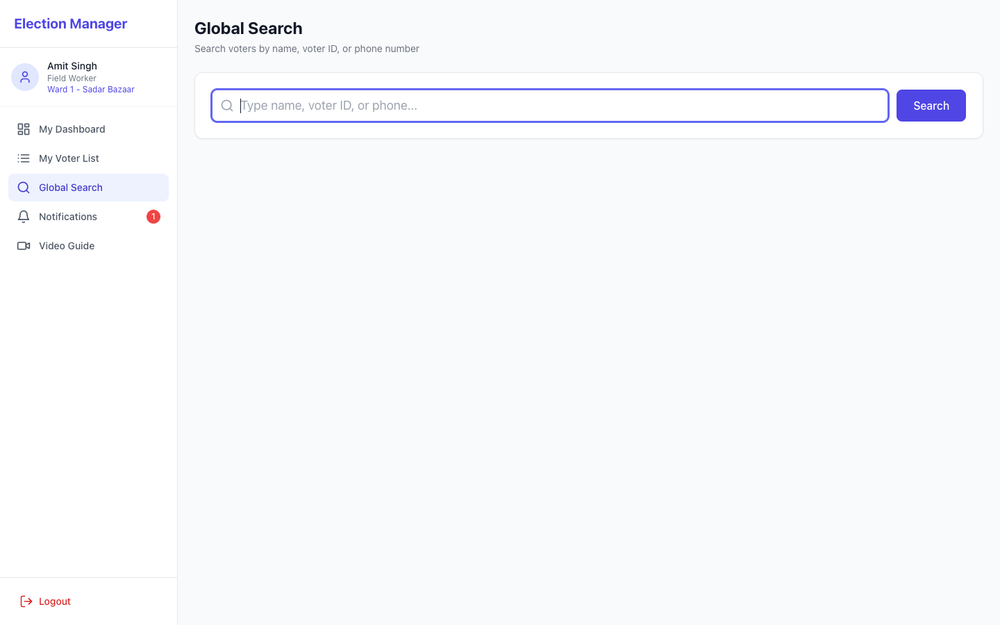

**What it does:**
- Same global search as admin but accessible to field workers
- Workers can search for any voter in any area
- Helps verify voter information during field visits

---

## How It Works — User Flows

### Flow 1: Super Admin Sets Up Campaign

```
1. Admin logs in → Dashboard shows overview
2. Admin creates Areas (Manage Areas → Add Area)
3. Admin creates Workers (Manage Team → Add User)
4. Admin assigns workers to areas
5. Admin uploads voter Excel file (Upload Voters)
6. System filters 18-35 eligible voters automatically
7. Admin assigns voter lists to workers (Voter List → Select → Assign)
8. Admin sends notification to all workers: "Campaign started!"
```

### Flow 2: Field Worker Collects Votes

```
1. Worker logs in with phone number → Sees "My Voter List"
2. Worker visits voter at their address
3. Worker shows Video Guide to explain voting process
4. Voter records video on government app
5. Worker marks voter as "Done" (green check button)
6. Status turns green — visible to all workers on same list
7. Vote counted in worker's stats + parent's stats
8. Admin sees real-time updates on Dashboard
```

### Flow 3: Shared List Collaboration

```
1. Area "Ward 1" assigned to Worker A, Worker B, Worker C
2. All 3 see the same voter list
3. Worker A marks "Arun Kumar" as Done → It goes green for everyone
4. Worker B sees "Arun Kumar" is already green → Moves to next voter
5. Credit goes to Worker A (marked_by field)
6. No duplicate work!
```

---

## Database Schema

### Users Table
| Column | Type | Description |
|---|---|---|
| id | INTEGER PK | Auto-incrementing ID |
| name | TEXT | Full name |
| phone | TEXT UNIQUE | Phone number (login) |
| password | TEXT | bcrypt hashed password |
| role | TEXT | 'super_admin' or 'field_worker' |
| parent_id | INTEGER FK | Parent user (for hierarchy) |
| area_id | INTEGER FK | Assigned area |
| is_active | INTEGER | 1=active, 0=deactivated |

### Areas Table
| Column | Type | Description |
|---|---|---|
| id | INTEGER PK | Auto-incrementing ID |
| name | TEXT | Area/ward/town name |
| district | TEXT | District name |

### Voters Table
| Column | Type | Description |
|---|---|---|
| id | INTEGER PK | Auto-incrementing ID |
| name | TEXT | Voter's full name |
| age | INTEGER | Voter's age |
| voter_id | TEXT | Government voter ID |
| father_name | TEXT | Father's name |
| phone | TEXT | Phone number |
| address | TEXT | Full address |
| gender | TEXT | M/F |
| area_id | INTEGER FK | Which area voter belongs to |
| assigned_to | INTEGER FK | Which worker is responsible |
| status | TEXT | 'pending', 'done', 'refused' |
| marked_by | INTEGER FK | Who changed the status |
| marked_at | DATETIME | When status was changed |

### Notifications Table
| Column | Type | Description |
|---|---|---|
| id | INTEGER PK | Auto-incrementing ID |
| title | TEXT | Notification title |
| message | TEXT | Message body |
| sent_by | INTEGER FK | Admin who sent it |
| target_area_id | INTEGER FK | NULL = all, or specific area |

### User Notifications Table (Read Tracking)
| Column | Type | Description |
|---|---|---|
| user_id | INTEGER FK | Worker ID |
| notification_id | INTEGER FK | Notification ID |
| is_read | INTEGER | 0=unread, 1=read |

### Videos Table
| Column | Type | Description |
|---|---|---|
| id | INTEGER PK | Auto-incrementing ID |
| title | TEXT | Video title |
| description | TEXT | Description |
| file_path | TEXT | Server file path |
| uploaded_by | INTEGER FK | Who uploaded |

### Activity Logs Table
| Column | Type | Description |
|---|---|---|
| user_id | INTEGER FK | Who performed action |
| action | TEXT | Action type (VOTER_STATUS, UPLOAD_VOTERS, etc.) |
| details | TEXT | Human-readable description |

---

## API Endpoints

### Authentication
| Method | Endpoint | Access | Description |
|---|---|---|---|
| POST | `/api/auth/login` | Public | Login with phone + password |
| GET | `/api/auth/me` | Authenticated | Get current user + unread count |

### Users
| Method | Endpoint | Access | Description |
|---|---|---|---|
| GET | `/api/users` | Authenticated | List users (filterable by role, area, parent) |
| GET | `/api/users/:id` | Authenticated | Get user detail + sub-workers + voter stats |
| POST | `/api/users` | Super Admin | Create new user |
| PUT | `/api/users/:id` | Admin/Self | Update user |
| POST | `/api/users/:id/add-sub-worker` | Admin/Self | Add sub-worker under user |
| GET | `/api/users/:id/hierarchy` | Authenticated | Get full hierarchy tree |

### Areas
| Method | Endpoint | Access | Description |
|---|---|---|---|
| GET | `/api/areas` | Authenticated | List all areas with stats |
| GET | `/api/areas/:id` | Authenticated | Area detail + workers + voter stats |
| POST | `/api/areas` | Super Admin | Create area |
| PUT | `/api/areas/:id` | Super Admin | Update area |
| DELETE | `/api/areas/:id` | Super Admin | Delete area |

### Voters
| Method | Endpoint | Access | Description |
|---|---|---|---|
| GET | `/api/voters` | Authenticated | List voters (filters: area, status, worker, eligible) |
| GET | `/api/voters/search?q=` | Authenticated | Global search by name/voter_id/phone |
| PUT | `/api/voters/:id/status` | Authenticated | Update voter status (done/refused/pending) |
| POST | `/api/voters/upload` | Super Admin | Upload Excel/CSV voter list |
| POST | `/api/voters/assign` | Super Admin | Bulk assign voters to worker |
| POST | `/api/voters/assign-area` | Super Admin | Assign all unassigned area voters to worker |

### Dashboard
| Method | Endpoint | Access | Description |
|---|---|---|---|
| GET | `/api/dashboard/stats` | Authenticated | Overall campaign statistics |
| GET | `/api/dashboard/area-stats` | Authenticated | Area-wise breakdown |
| GET | `/api/dashboard/worker-stats` | Authenticated | Worker-wise breakdown |
| GET | `/api/dashboard/today` | Authenticated | Today's activity feed |
| GET | `/api/dashboard/recent-activity` | Authenticated | Recent activity logs |

### Notifications
| Method | Endpoint | Access | Description |
|---|---|---|---|
| GET | `/api/notifications` | Authenticated | List notifications (admin sees all, worker sees own) |
| POST | `/api/notifications` | Super Admin | Send notification |
| PUT | `/api/notifications/:id/read` | Authenticated | Mark as read |
| PUT | `/api/notifications/read-all` | Authenticated | Mark all as read |

### Videos
| Method | Endpoint | Access | Description |
|---|---|---|---|
| GET | `/api/videos` | Authenticated | List all videos |
| POST | `/api/videos` | Authenticated | Upload video |
| DELETE | `/api/videos/:id` | Super Admin | Delete video |

---

## Security Architecture

1. **Authentication**: JWT tokens with 7-day expiry. Token required for all `/api/*` endpoints.
2. **Password Storage**: bcryptjs with salt rounds = 10. Passwords never stored in plain text.
3. **Role-Based Access Control (RBAC)**: Middleware checks user role before allowing admin-only operations.
4. **Data Isolation**: Field workers can only see voters assigned to them and their sub-workers.
5. **No Data in URLs**: All sensitive data passed via request body (POST) or headers (JWT).
6. **Input Validation**: Server-side validation on all endpoints.
7. **Activity Logging**: All important actions logged with user ID, action type, and timestamp.
8. **Auto Token Refresh**: Frontend automatically redirects to login if token expires (401 interceptor).

---

## How to Run

### Prerequisites
- Node.js (any version 18+)
- npm

### Setup

```bash
# 1. Install backend dependencies
cd election-app/backend
npm install

# 2. Install frontend dependencies
cd ../frontend
npm install

# 3. Build frontend (for production serving)
npm run build
```

### Run (Production Mode — Single URL)

```bash
cd election-app/backend
node server.js
# Open http://localhost:4000
```

### Run (Development Mode — Hot Reload)

```bash
# Terminal 1: Backend
cd election-app/backend
npm run dev

# Terminal 2: Frontend
cd election-app/frontend
npm run dev
# Open http://localhost:3000
```

### Share with Team (Without Deployment)

```bash
npx localtunnel --port 4000
# Gives you a public URL like: https://xxx.loca.lt
# Share this URL with your team!
```

### Reset Database

```bash
rm election-app/backend/election.db
# Restart server — fresh data will be seeded
```

---

## Test Credentials

| Role | Name | Phone | Password | Area |
|---|---|---|---|---|
| Super Admin | Rajesh Kumar | 9999999001 | admin123 | All areas |
| Super Admin | Sunil Sharma | 9999999002 | admin123 | All areas |
| Super Admin | Priya Verma | 9999999003 | admin123 | All areas |
| Field Worker | Amit Singh | 8888888001 | worker123 | Ward 1 - Sadar Bazaar |
| Field Worker | Deepak Yadav | 8888888002 | worker123 | Ward 2 - Civil Lines |
| Field Worker | Ravi Tiwari | 8888888003 | worker123 | Ward 3 - Rajpur Road |
| Field Worker | Pooja Gupta | 8888888004 | worker123 | Ward 4 - Nehru Colony |
| Field Worker | Manoj Pandey | 8888888005 | worker123 | Ward 5 - Gandhi Nagar |
| Field Worker | Neha Rawat | 8888888006 | worker123 | Ward 6 - Subhash Chowk |
| Sub-Worker | Rahul Chauhan | 7777777001 | worker123 | Ward 1 (under Amit) |
| Sub-Worker | Vikram Joshi | 7777777002 | worker123 | Ward 1 (under Amit) |
| Sub-Worker | Sanjay Negi | 7777777003 | worker123 | Ward 2 (under Deepak) |

---

## Sample Data Included

- **8 Areas/Wards** across 5 districts
- **3 Super Admins**
- **6 Field Workers** assigned to different areas
- **3 Sub-Workers** under field workers
- **30 Voters** with mix of ages (some eligible 18-35, some not)
- **Pre-marked statuses**: 11 done, 4 refused, 15 pending
- **3 Notifications** already sent
- **Activity logs** with timestamps

---

*Built with React + Node.js + SQLite | Designed for mobile-first field operations*
